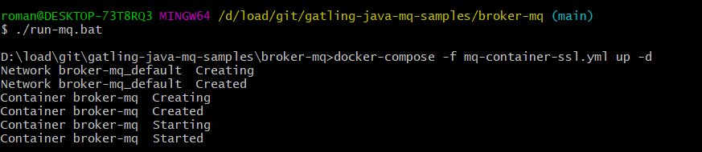
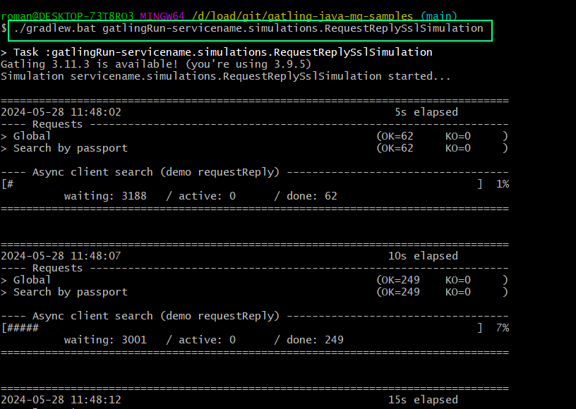

# gatling-java-mq-samples

Examples of IBM MQ gatling load tests

Примеры скриптов для IBM MQ.

# Documentation

Возможно, вам будет удобно поддерживать документацию по скриптам в стиле JavaDoc.

Это может выглядеть примерно так:

- [JavaDoc](https://htmlpreview.github.io/?https://github.com/Roman-Kislyy/gatling-java-mq-samples/blob/main/docs/javadoc/index.html)

# Небольшие инструкции по работе с Gatling и Gradle:

- [Как запустить тест при помощи Gradle](docs/how-to-slides/Gtg-How-to-start-test.pptx)
- [Какие бывают переменные в Gatling](docs/how-to-slides/Gtg-Variables.pptx)
- [Про разные сценарии нагрузки. Максимум, стресс и другое](docs/how-to-slides/Gtg-Scenario-injections-load-users.pptx)
- [О структуре скриптов на Gatling. Термины для начинающих](docs/how-to-slides/Gtg-Termins-script-structure.pptx)
 
# Быстрый старт

## Можно запустить MQ брокер локально для проверки теста. Вам потребуется Docker Desktop.
`cd ./broker-mq/`
`./run-mq.bat`
`cd ../`

## Чтобы запустить тест при помощи Gradle plugin, выполните команду:

`./gradlew.bat gatlingRun-servicename.simulations.RequestReplySslSimulation`

или 

`gradlew.bat gatlingRun-servicename.simulations.RequestReplySslSimulation`

В зависимости от окружения.

